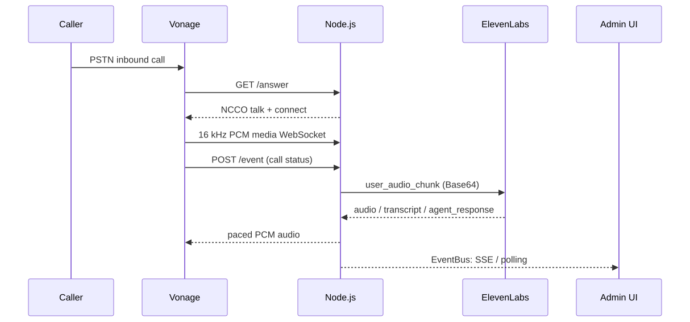

<!-- _class: cover -->

# Phone Voice Agent Architecture

## Vonage Voice API × ElevenLabs Conversational AI

Real-time voice bridge and speaker-separated transcript dashboard built with Node.js / Express

 

**Project:** `vonage-voice-ws-elevenlabs-convAI-demo`  
**Flow:** PSTN inbound call → AI voice conversation → live admin monitoring

---

<!-- _class: system-overview -->

# System Overview

  
Caller PSTN

  
→

  
Vonage Voice API LVN / NCCO

  
⇄

  
Node.js bridge Media relay / event aggregation

  
⇄

  
ElevenLabs STT / LLM / TTS / VAD

  

    <h3>Call and media path</h3>
    <ul>
      <li>Answer webhook returns NCCO to connect the call to a WebSocket media stream</li>
      <li>The server relays encoded audio and aggregates AI and call events</li>
      <li>STT / LLM / TTS / VAD run on the ElevenLabs side</li>
    </ul>
  

  

    <h3>Operations and monitoring path</h3>
    <ul>
      <li>Authenticated admin UI displays speaker-separated transcripts</li>
      <li>The latest 500 EventBus events are delivered through SSE and polling</li>
      <li>No database: events and sessions are kept in memory</li>
    </ul>
  

---

<!-- _class: architecture -->

# Overall Architecture

  
<h3>Webhook / NCCO</h3><code>/answer</code> returns talk + connect; <code>/event</code> collects call status.

  
<h3>Media bridge</h3><code>src/bridge.js</code> relays PCM and handles interruption, pacing, and queue limits.

  
<h3>Event fanout</h3><code>src/events.js</code> assigns sequential <code>seq</code> values to typed events and retains the latest 500.

  
<h3>Admin / auth</h3><code>src/auth.js</code> and <code>src/routes/admin.js</code> provide session auth, SSE, and state APIs.

---

<!-- _class: sequence -->

# From Call Setup to AI Audio Response

Call events (<code>/event</code>) and conversation events (ElevenLabs WebSocket) are both aggregated through the server's shared EventBus.

---

<!-- _class: audio-bridge -->

# Audio Bridge: How It Works

  

    <h3>Caller → AI</h3>
    <ol>
      <li>Receive 16 kHz PCM from Vonage</li>
      <li>Base64-encode and send to ElevenLabs as <code>user_audio_chunk</code></li>
      <li>Optionally save audio under <code>recordings/</code></li>
    </ol>
    
<strong>Input:</strong> audio/l16;rate=16000 <strong>Frame:</strong> 640 bytes ≈ 20 ms

  

  

    <h3>AI → Caller</h3>
    <ol>
      <li>Decode the <code>audio</code> event to PCM</li>
      <li>Send 640-byte chunks to Vonage every 18 ms</li>
      <li>Queue capped at 512 KB; discard oldest audio when full</li>
    </ol>
    
<strong>Backpressure:</strong> A bounded outbound queue limits memory growth when delivery stalls.

  

  
VAD detects interruption

→

  
Drop unsent audio

→

  
<code>action: clear</code> Clear Vonage playback

→

  
Resume next response

<strong>Separation of concerns:</strong> ElevenLabs handles STT / LLM / TTS / VAD. Node.js handles encoding, pacing, event relay, and connection lifecycle.

---

<!-- _class: data-flow -->

# Key Data Structures and Event Delivery

  

    <h3>EventBus event record</h3>
    <pre><code>{
  "seq": 42, "ts": "ISO-8601",
  "type": "user_transcript", "speaker": "user",
  "text": "How can I help you?",
  "is_final": true, "call_uuid": "..."
}</code></pre>
    
Key types: call_event / user_transcript / agent_response / interruption / bridge_error / language_changed

  

  

    <h3>History and real-time delivery</h3>
    <ul>
      <li><code>EventBus</code>: assigns <code>seq</code> and retains the latest 500 events in memory</li>
      <li><code>GET /admin/events</code>: history replay + SSE stream</li>
      <li><code>GET /admin/api/state?since=seq</code>: fetch events after the given sequence</li>
      <li>1.5-second polling fallback; deduplicate by <code>seq</code></li>
      <li>Browser transcript is also capped at 500 items</li>
    </ul>
  

<strong>Delivery resilience:</strong> Polling catches up if a tunnel or proxy buffers SSE. Sequence numbers prevent duplicates across both transports.

---

<!-- _class: dense -->

# API Design and Security Boundaries

| Endpoint | Purpose | Authentication / input |
|---|---|---|
| `GET /health` | Health check | No authentication |
| `GET/POST /answer` | Vonage Answer webhook → NCCO | Public endpoint; unauthenticated |
| `POST /event` | Vonage call status events | Public endpoint; unauthenticated |
| `WS /socket?peer_uuid=…` | Media bridge | UUID format validated |
| `GET/POST /login`, `POST /logout` | Admin login / logout | Lock 5 min after 5 failed attempts |
| `GET /admin`, `/admin/*` | Admin UI / language / state / SSE | Session required |

  

    <h3>Protections in place</h3>
    <ul class="small">
      <li>Timing-safe credential comparison and per-IP login rate limiting</li>
      <li>Session ID regenerated after successful login</li>
      <li>Cookies: httpOnly / SameSite=Lax; Secure when served behind HTTPS</li>
      <li>Admin APIs / SSE require auth; WebSocket validates Vonage UUID format</li>
      <li>Pre-push hooks scan for secrets and recording files</li>
    </ul>
  

  

    <h3>Operational boundaries to consider</h3>
    <ul class="small">
      <li>Vonage webhooks are public and unauthenticated. Require HTTPS and consider sender / signature validation in deployment</li>
      <li><code>peer_uuid</code> format validation alone does not authenticate a WebSocket client</li>
      <li>Sessions and event history are in memory; they are not shared across restarts or instances</li>
      <li>If recording is enabled, define consent, access, and retention policies</li>
    </ul>
  

---

<!-- _class: summary -->

# Summary: Strengths and Improvement Roadmap

  

    <h3>Design strengths</h3>
    <ul>
      <li>One small Node.js service combines call control, media relay, and admin UI</li>
      <li>Delegates AI audio processing to ElevenLabs, keeping local responsibilities focused</li>
      <li>Handles interruption, bounds the send queue, and pings connections for liveness</li>
      <li>SSE plus polling makes monitoring more resilient behind proxies</li>
      <li>Core modules are covered by built-in Node.js tests without external APIs</li>
    </ul>
  

  

    <h3>Improvement priorities</h3>
    <ol>
      <li><strong>Production scale:</strong> Move sessions / events to Redis or similar for multi-instance operation</li>
      <li><strong>Boundary protection:</strong> Add webhook signature / sender validation and WebSocket client authentication</li>
      <li><strong>Operations:</strong> Add structured logs, latency / disconnect / dropped-audio metrics, and readiness checks</li>
      <li><strong>Data governance:</strong> Define consent, retention, and deletion policies for recordings / events</li>
    </ol>
  

  <strong>Takeaway:</strong> The core is a lightweight real-time bridge: establish the call with NCCO, relay two-way audio over WebSockets, and deliver conversation events to the operations UI through EventBus.

