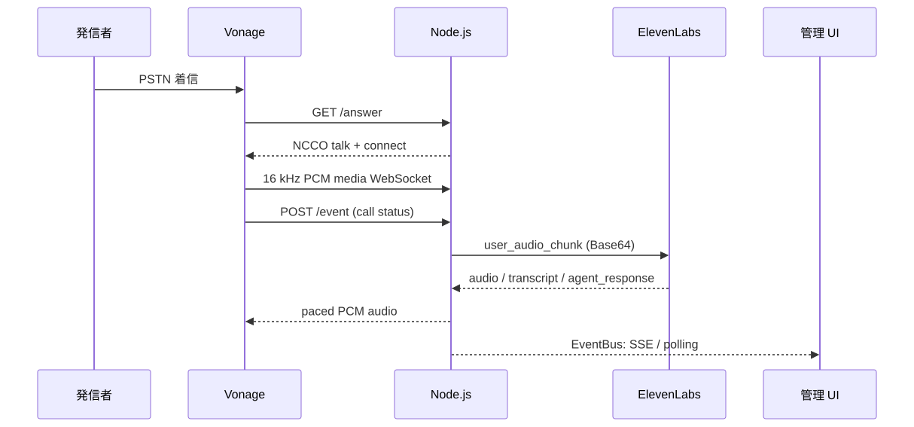

<!-- _class: cover -->

# 電話音声エージェントの全体像

## Vonage Voice API × ElevenLabs Conversational AI

Node.js / Express によるリアルタイム音声ブリッジと、話者分離トランスクリプト管理 UI

 

**対象:** `vonage-voice-ws-elevenlabs-convAI-demo`  
**構成:** PSTN 着信 → 音声 AI 対話 → 管理画面でライブ確認

---

# システム概要

  
発信者 PSTN

  
→

  
Vonage Voice API LVN / NCCO

  
⇄

  
Node.js ブリッジ 音声中継 / イベント集約

  
⇄

  
ElevenLabs STT / LLM / TTS / VAD

  

    <h3>通話・音声経路</h3>
    <ul>
      <li>Vonage の Answer webhook に NCCO を返し、WebSocket メディアを接続</li>
      <li>サーバーは音声を符号化して中継し、AI と通話のイベントを集約</li>
      <li>STT / LLM / TTS / VAD は ElevenLabs 側で実行</li>
    </ul>
  

  

    <h3>運用・監視経路</h3>
    <ul>
      <li>ログイン保護された管理 UI が話者別トランスクリプトを表示</li>
      <li>EventBus の最新 500 イベントを SSE とポーリングで配信</li>
      <li>DB は使わず、イベントとセッションはメモリ上に保持</li>
    </ul>
  

---

# 全体アーキテクチャ

  
<h3>Webhook / NCCO</h3><code>/answer</code> が talk + connect を返し、<code>/event</code> が通話状態を集約。

  
<h3>Media bridge</h3><code>src/bridge.js</code> が PCM を転送し、割り込み・ペーシング・キュー上限を処理。

  
<h3>Event fanout</h3><code>src/events.js</code> が type 付きイベントに連番 seq を付与し、最新 500 件を保持。

  
<h3>Admin / auth</h3><code>src/auth.js</code> と <code>src/routes/admin.js</code> がセッション認証、SSE、状態 API を提供。

---

# 通話開始から音声応答まで

通話イベント（/event）と会話イベント（ElevenLabs WebSocket）は、どちらもサーバー内で共通の EventBus に集約されます。

---

<!-- _class: audio-bridge -->

# 音声ブリッジの要点

  

    <h3>発信者 → AI</h3>
    <ol>
      <li>Vonage から 16 kHz PCM を受信</li>
      <li>Base64 化して <code>user_audio_chunk</code> で ElevenLabs へ</li>
      <li>任意で音声を <code>recordings/</code> に保存</li>
    </ol>
    
<strong>入力:</strong> audio/l16;rate=16000 <strong>1フレーム:</strong> 20 ms 相当 = 640 bytes

  

  

    <h3>AI → 発信者</h3>
    <ol>
      <li><code>audio</code> イベントを PCM に復号</li>
      <li>640 bytes 単位で 18 ms ごとに Vonage へ送信</li>
      <li>キュー上限 512 KB。超過時は古い音声を破棄</li>
    </ol>
    
<strong>バックプレッシャー:</strong> 送信音声キューに上限を設け、遅延時のメモリ増加を抑制。

  

  
VAD が割り込み検知

→

  
未送信音声を破棄

→

  
<code>action: clear</code> Vonage 再生を消去

→

  
次の応答を再開

<strong>担当分離:</strong> STT / LLM / TTS / VAD は ElevenLabs。Node.js はエンコード・ペーシング・イベント中継・接続ライフサイクルを担当。

---

<!-- _class: data-flow -->

# 主要データ構造とイベント配信

  

    <h3>EventBus のイベントレコード</h3>
    <pre><code>{
  "seq": 42, "ts": "ISO-8601",
  "type": "user_transcript", "speaker": "user",
  "text": "ご用件をお願いします",
  "is_final": true, "call_uuid": "..."
}</code></pre>
    
主な type: call_event / user_transcript / agent_response / interruption / bridge_error / language_changed

  

  

    <h3>履歴とリアルタイム配送</h3>
    <ul>
      <li><code>EventBus</code>: seq を付与し、直近 500 件をメモリ保持</li>
      <li><code>GET /admin/events</code>: 履歴リプレイ + SSE 配信</li>
      <li><code>GET /admin/api/state?since=seq</code>: 指定 seq より後を取得</li>
      <li>1.5 秒ごとのポーリングを併用、seq で重複排除</li>
      <li>ブラウザの表示も最大 500 件に制限</li>
    </ul>
  

<strong>一貫性の工夫:</strong> SSE がトンネル等でバッファリングされてもポーリングで追いつける。SSE とポーリングの重複はイベント seq で排除。

---

<!-- _class: dense -->

# API 設計とセキュリティ境界

| エンドポイント | 用途 | 認証・入力 |
|---|---|---|
| `GET /health` | ヘルスチェック | 認証なし |
| `GET/POST /answer` | Vonage Answer webhook → NCCO | 外部公開・認証なし |
| `POST /event` | Vonage 通話状態イベント | 外部公開・認証なし |
| `WS /socket?peer_uuid=…` | 音声メディアブリッジ | UUID 形式を検証 |
| `GET/POST /login`, `POST /logout` | 管理者ログイン・ログアウト | 失敗 5 回で 5 分ロック |
| `GET /admin`, `/admin/*` | 管理 UI / 言語 / 状態 / SSE | セッション必須 |

  

    <h3>実装されている保護</h3>
    <ul class="small">
      <li>ログイン資格情報の timing-safe 比較、IP 単位のレート制限</li>
      <li>ログイン時にセッション ID を再生成</li>
      <li>Cookie: httpOnly / SameSite=Lax、HTTPS 条件下で Secure</li>
      <li>管理 API / SSE は requireAuth、WS は Vonage UUID 形式を検証</li>
      <li>秘密ファイル・録音ファイルを push 防止フックで検査</li>
    </ul>
  

  

    <h3>運用で注意する境界</h3>
    <ul class="small">
      <li>Vonage webhook は認証なしの公開 URL。HTTPS と送信元・署名検証を配備要件に含める</li>
      <li><code>peer_uuid</code> の形式チェックは、単独では WebSocket の認証ではない</li>
      <li>セッションとイベント履歴はメモリ内。再起動・複数インスタンスで共有されない</li>
      <li>音声録音を有効にする場合、同意・アクセス・保持期間を定義</li>
    </ul>
  

---

<!-- _class: summary -->

# まとめ — 特長と改善ロードマップ

  

    <h3>設計上の特長</h3>
    <ul>
      <li>小さな Node.js サービスに通話制御・音声中継・管理 UI を集約</li>
      <li>AI 音声処理を ElevenLabs に委譲し、ローカルの責務を限定</li>
      <li>割り込み対応、送信キュー上限、接続 ping でリアルタイム特性をケア</li>
      <li>SSE とポーリングの併用でプロキシ環境の監視画面を堅牢化</li>
      <li>外部 API 不要の Node.js 組み込みテストで主要モジュールを検証</li>
    </ul>
  

  

    <h3>改善の優先候補</h3>
    <ol>
      <li><strong>本番スケール:</strong> セッション / イベントを Redis 等へ外出しし、複数インスタンスに対応</li>
      <li><strong>境界保護:</strong> Webhook 署名・送信元検証、WebSocket 接続の認証を追加</li>
      <li><strong>運用性:</strong> 構造化ログ、遅延・切断・バッファ破棄のメトリクス、readiness を整備</li>
      <li><strong>データ管理:</strong> 録音・イベントの同意、保持、削除ポリシーを明文化</li>
    </ol>
  

  <strong>結論:</strong> このデモの中核は「NCCO で接続を確立し、WebSocket で音声を双方向中継、EventBus で会話状況を運用 UI へ配信する」軽量なリアルタイム・ブリッジ。

